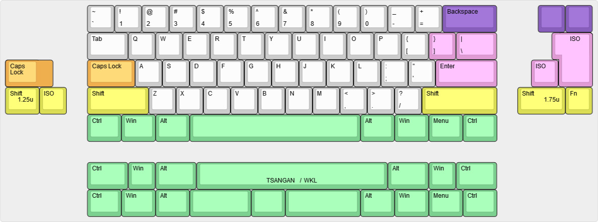
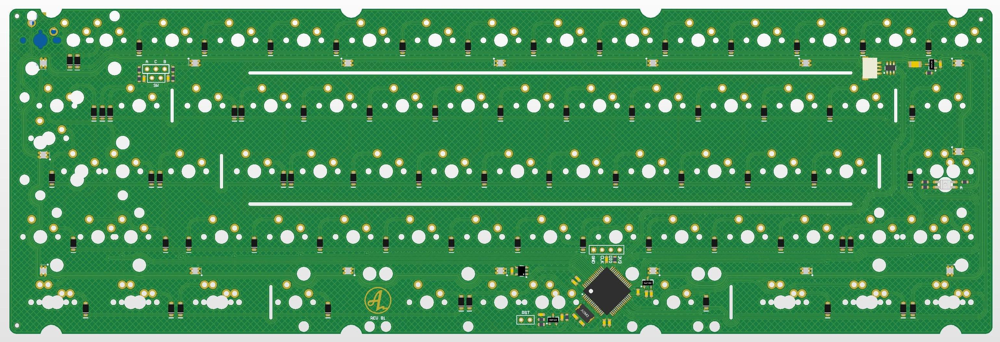

# A collection of bootlegs

CAUSION, REVISION B IS UNTESTED AND NO QMK IMPLEMENTATION IS DONE. MAJOR CHANGES TO REVISION B IS LIKELY

# BOOTLEG
- Prophet style flex cuts
- STM32F103Rx or GD32F103Rx
- Daughter board connector, ai03 spec.

## Layout support for BOOTLEG-1 rev B1: 

## View of PCB rev B1: 

## Disclaimer:
Project is open source, I take no responsibility for others using these files.

## Revisions:
- A1: Initial prototype
- A2: Added JST-connector for daughter board. Removed notch for usb-connector for better compatibility on daughter board builds.
- B1: Changed matrix for better support for ISO-alps and made all bootlegs compatible with each other (same QMK and VIA implementation for all four), removed usb-port, changed processor.
