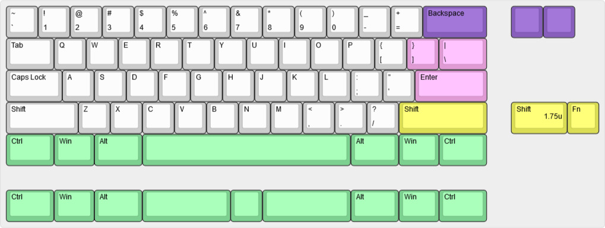
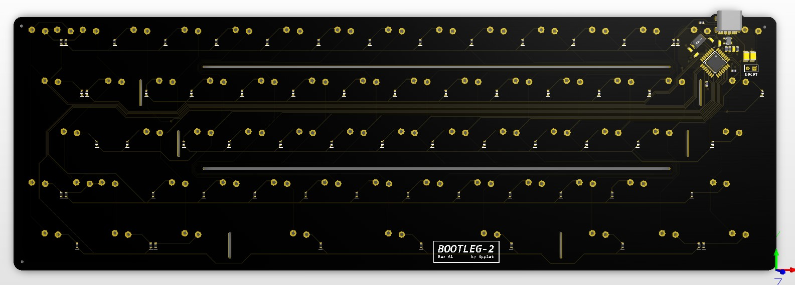

# A collection of bootlegs

## BOOTLEG-1
- USB-C
- MX switches
- ATmega32U2
- Prophet style flex cuts

## Layout support for BOOTLEG-1: 

## BOOTLEG-1: 

## BOOTLEG-2
- USB-C
- ALPS switches
- ATmega32U2
- Prophet style flex cuts
- Intended for use with AEK-keycaps

## Layout support for BOOTLEG-2: 

## BOOTLEG-2: 

## Disclaimer:
Project is open source, I take no responsibility for others using these files.