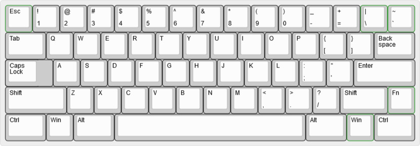
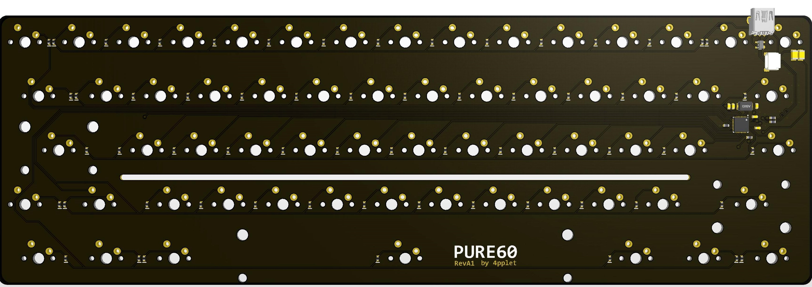
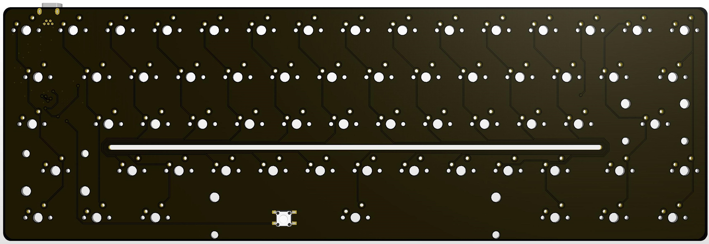

# pure60

Just a concept, pay this no mind.

## Status:
Concept phase.

## Some features:
- QMK
- Mini USB
- atmega32u2 in QFN
- Cherry PCB-stab support
- Fixed MX-HHKB layout (with WKL or Tsangan bottom row support) and stepped capslock

## Layout support: 

## Altium view of PCB

## Revisions:
- Rev A1: Initial prototype based on waffling60.