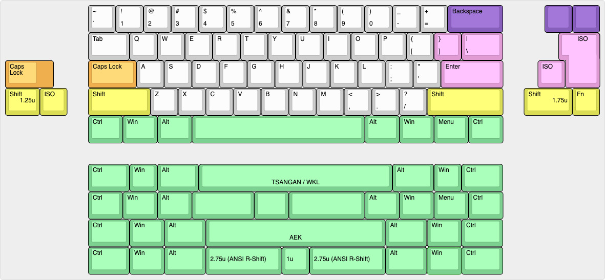
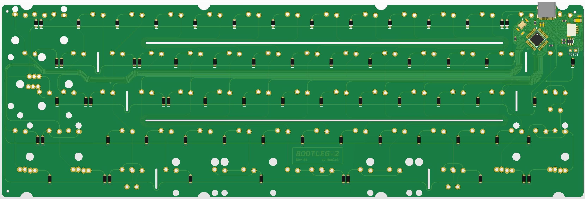
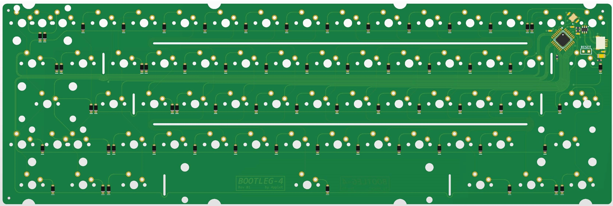

# A collection of bootlegs

# BOOTLEG-1
- USB-C
- MX switches
- ATmega32U2
- Prophet style flex cuts

## Layout support for BOOTLEG-1 rev B1: 

## View of PCB rev B1: 

# BOOTLEG-2
- USB-C
- ALPS switches
- ATmega32U2
- Prophet style flex cuts

## Layout support for BOOTLEG-2 rev B1: 

## View of PCB, rev B1: 

# BOOTLEG-3
- USB-C
- SMK switches
- ATmega32U2
- Prophet style flex cuts
- Intended for use with Cherry-keycaps, will work with modern Alps keycaps if using Alps-mount SMK.

## Layout support for BOOTLEG-3 rev B1: 

## View of PCB rev B1: 

# BOOTLEG-4
- MX switches
- ATmega32U2
- Prophet style flex cuts
- No usb-connector, only for daughter board use
- Limited layout support

## Layout support for BOOTLEG-4 rev B1: 

## View of PCB rev B1: 

## Disclaimer:
Project is open source, I take no responsibility for others using these files.

## Revisions:
- A1: Initial prototype
- A2: Added JST-connector for daughter board. Removed notch for usb-connector for better compatibility on daughter board builds.
- B1: Changed matrix for better support for ISO-alps and made all bootlegs compatible with each other (same QMK and VIA implementation for all four)
